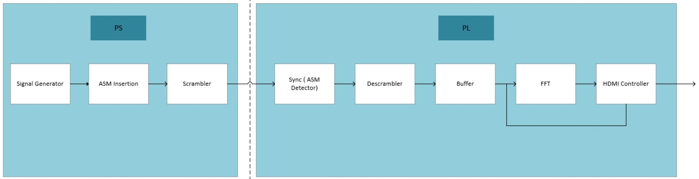

This is a simple signal processing project on Zynq which includes:
  - Introduction to Scrambler and Descrambler
  - Introduction to FFT and displaying the spectrum of digital signals via HDMI on the display

    

**Project describtion is provided in FPGA_Project_Draft(persian) but reports are adequate to read in English in corresponding folders!**
     
*July 2024* 
