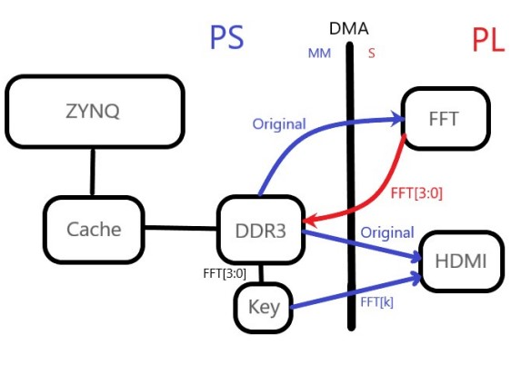

## Stage 1:
In this phase, we initially create four types of square, sawtooth, triangular, and sine waves 
in PS (each with 1024 samples, 8-bit). You transfer this signal to PL through the HP port with 
the appropriate configuration for DMA. By pressing 1KEY_PS, the sent signal to the FPGA changes 
between the four created signals.

    

for a more detailed description, you may read *Report01*
for simulation, vivado project is available at *project* folder
