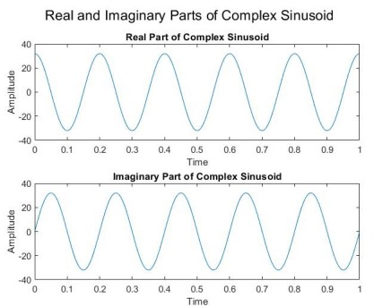
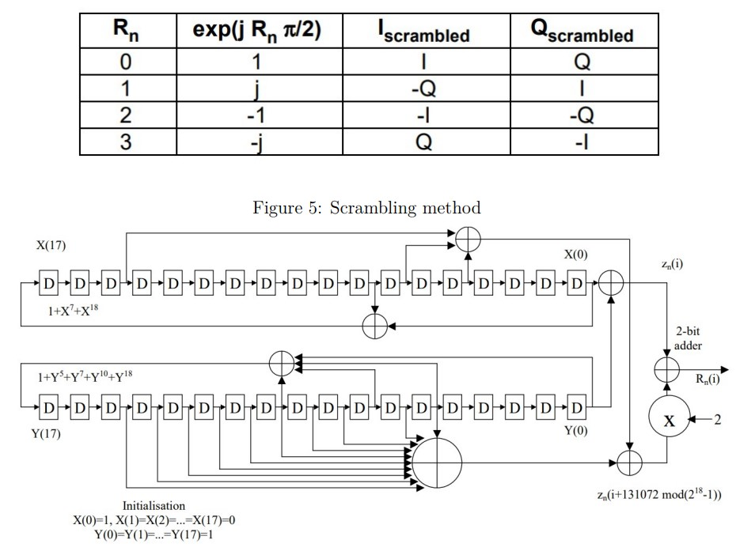
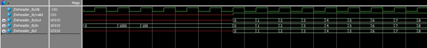

## Stage 2:
In this satge, a conventional ASM structure is added along with a Scrambler. In fact,in this project
we will implement a transmitter in the PS section and a receiver in the PL section.
We use the DS/CCS header or send multiple samples as a header and wait to receive it at the receiver
to reset our Descrambler.

for a more detailed description, you may read *Report02*

    

What folder *Signal generator-Header* contains.

    

What folder *scrambler* contains.

    

What folder *Descrambler-Deheader* contains.
